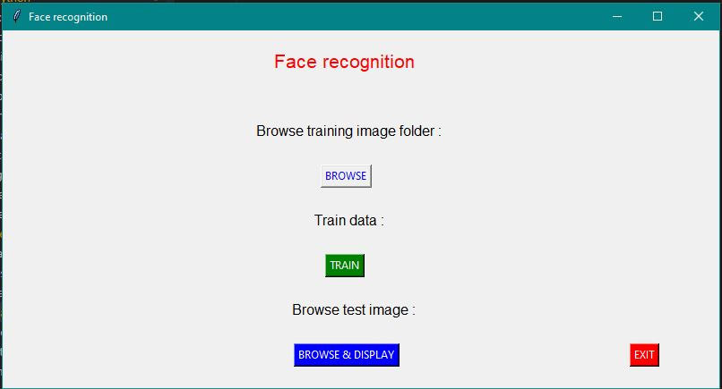
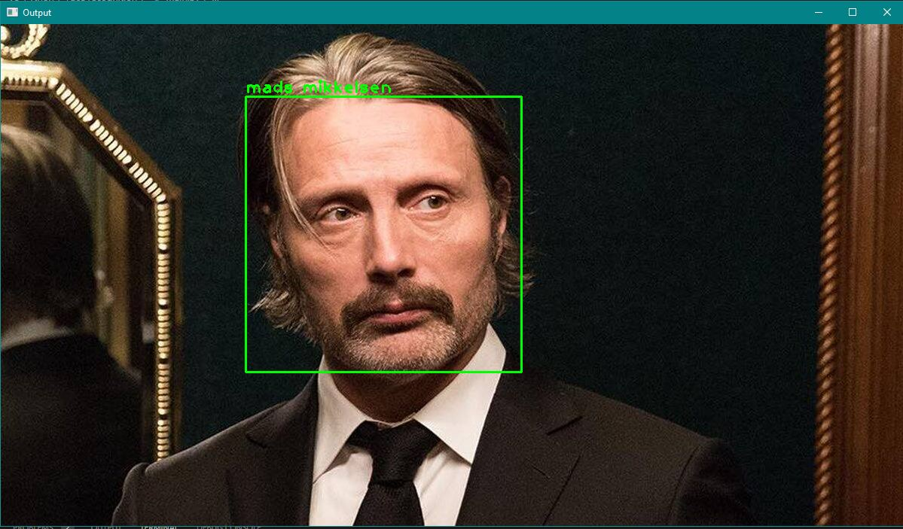

# Face recognition

It is a simple yet efficient face recognition system that can recognize people with great accuracy.

## Technologies used

* Python
* Numpy
* OpenCV
* TKinter for frontend

## Steps to use the system

* First install all the dependencies using the following command
  `pip install -r requirements.txt`
* Then create your training set by creating a folder of the person you want to train and inside the folder copy the images of the person in .jpg format
* Then run the command to launch the program
  `pip main.py`
* Now, browse the parent folder containing subfolders having the name of people with their images inside them
* Now click on train to train the system
* Atlast , browse the image to test the model

## Screenshot

* GUI screen image

* Output sample

